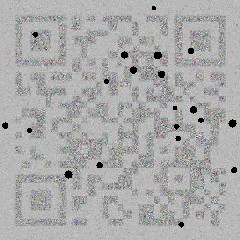
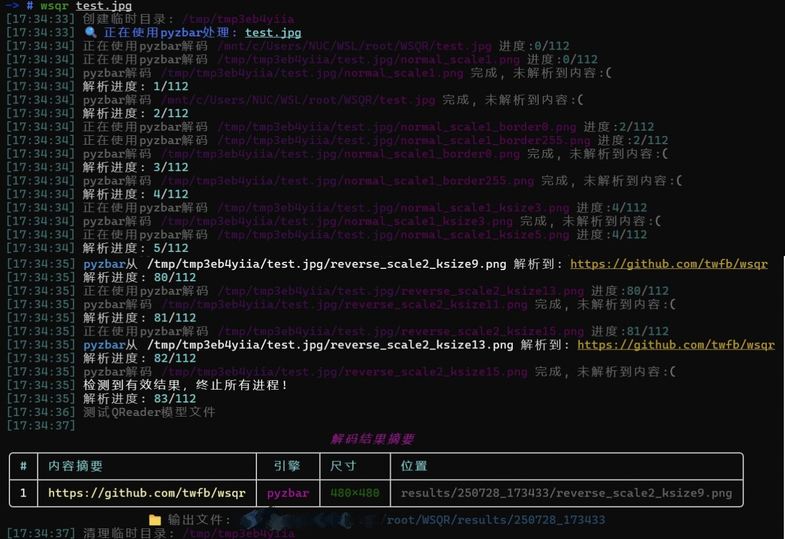

# 🚀 哇塞二维码 (wsqr) - 终极二维码解码利器

**哇塞二维码(wsqr)** 是一款功能强大的二维码解码工具，支持多引擎并行处理、智能图像预处理和多种输出格式。无论是模糊、变形还是低对比度的二维码，wsqr都能高效识别！

## ✨ 图片测试


## ✨ 功能亮点

- 🔍 **多引擎并行解码**：集成OpenCV、Pyzbar、ZXing-C++和深度学习驱动的QReader
- 🧠 **智能图像预处理**：自动优化模糊、低对比度、变形和反色二维码
- ⚡ **高性能处理**：支持多进程并行处理，充分利用CPU资源
- 📊 **详细结果输出**：提供文本和图像结果，包含解码引擎和图像尺寸信息
- 🎯 **智能终止机制**：检测到有效结果后可提前终止处理
- 🖼️ **GIF支持**：自动提取并处理GIF中的关键帧

## 📥 安装指南

### 系统要求
- Python 3.7+
- pip包管理器

### 安装步骤
```bash
pip install wsqr
```
### 国内安装步骤
```bash
pip install wsqr-cn
```
## 🛠️ 使用说明

### 基本用法
```bash
wsqr 图片路径 [选项]
```

### 命令行选项
| 选项 | 缩写 | 描述 |
|------|------|------|
| `--engine` | `-e` | 选择解码引擎 (pyzbar/zxingcpp/opencv/qreader) |
| `--complete` | `-c` | 即使检测到内容也等待所有任务完成 |
| `--output` | `-o` | 结果输出目录 (默认: results/当前时间) |
| `--parallel` | `-p` | 并行工作线程数 (默认: CPU核心数) |
| `--debug` | `-d` | 启用调试模式，保留中间文件 |

### 解码引擎
| 引擎 | 特点 | 推荐场景 |
|------|------|----------|
| `pyzbar` | 基于ZBar库，速度快 | 大多数场景 |
| `zxingcpp` | C++实现，高性能 | 识别速度较快 |
| `opencv` | OpenCV内置解码器 | 基本二维码识别 |
| `qreader` | 深度学习模型| 模糊/变形/低对比度二维码 |

## 🧩 图像处理技术

wsqr采用先进的图像预处理技术，包括：

1. **自动对比度增强** - 优化低对比度图像
2. **智能二值化** - 适应不同光照条件
3. **多重缩放处理** - 优化不同尺寸的二维码
4. **边框增强** - 处理边缘裁剪的二维码
5. **高斯模糊处理** - 优化模糊图像
6. **反色支持** - 自动识别反色二维码
7. **GIF关键帧提取** - 高效处理动态二维码

## ⚙️ 性能优化

- **并行处理**：充分利用多核CPU
- **内存管理**：智能控制资源占用
- **任务调度**：优化解码顺序（优先使用高效引擎）
- **提前终止**：检测到有效结果后自动停止冗余处理

## 📝 结果输出

wsqr提供两种结果输出：
1. **文本文件** (`results.txt`)：
   - 解码文本内容
   - 使用的解码引擎
   - 原始字节数据
   - 图像尺寸信息

2. **图像文件**：
   - 保存成功解码的图像变体
   - 保留预处理后的优化图像

## 🐞 调试模式

使用`--debug`选项启用调试模式：
```bash
wsqr qr_code.jpg --debug
```
在调试模式下：
- 保留所有中间处理图像
- 显示详细处理日志
- 输出额外调试信息

## ⚠️ 注意事项
**内存管理**：
- 使用QReader时，建议减少并行任务数
- 大图像处理可能需要更多内存

## 🚀 使用示例

### 示例1：基本使用
```bash
wsqr difficult_qr.png
```

### 示例2：指定解码引擎
```bash
wsqr blurry_qr.jpg -e pyzbar -e qreader
```

### 示例3：完整处理并保存结果
```bash
wsqr large_image.png -c -o scan_results
```

### 示例4：处理GIF二维码
```bash
wsqr animated_qr.gif
```

## 📜 输出示例

```plaintext
结果 #1 (pyzbar) /root/WSQR/results/250728_181335/reverse_scale2_ksize9.png 480x480:
Text: 'https://github.com/twfb/wsqr'
Bytes: b'https://github.com/twfb/wsqr'
```

## 📄 许可证

本项目采用 [GPLv3 许可证](LICENSE)
---

**哇塞二维码** - 让每一次扫描都变得简单高效！ 🚀
